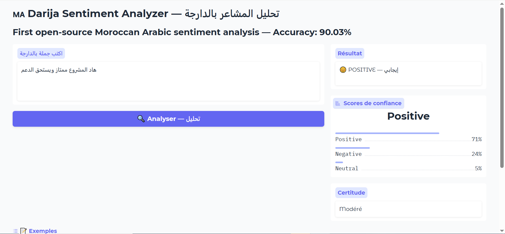

<div align="center">


# 🇲🇦 Darija Sentiment Analysis
### تحليل المشاعر بالدارجة المغربية

**First open-source end-to-end sentiment analysis system for Moroccan Arabic (Darija)**

[](https://python.org)
[](https://huggingface.co)
[](https://huggingface.co/CAMeL-Lab)
[]()
[]()
[](LICENSE)
[]()

*Detecting sentiment in a language that 40 million people speak — but AI has largely ignored.*

</div>

---

## 🚨 The Problem Nobody Solved

**40 million Moroccans** speak Darija — a unique blend of Arabic, French, Berber, and Spanish.

Yet today, **zero production-ready NLP tools exist for Darija sentiment analysis.**

This means:
- 🏢 Moroccan companies **cannot analyze customer feedback** at scale
- 📊 Researchers **cannot study public opinion** on Moroccan social media
- 🏛️ Organizations **cannot monitor citizen sentiment** effectively
- 🛒 E-commerce platforms **cannot process Moroccan reviews** automatically

**This project directly addresses that gap.**

---

## 🌐 Live Demo

<div align="center">



*Type any Darija sentence → get sentiment + confidence scores in real time*

</div>

```bash
python app/gradio_demo.py
# Open: http://127.0.0.1:7860
```

---

## 📊 Dataset — 8,619 Darija Comments

<div align="center">


*Well-balanced: 51% Positive · 47.2% Negative · 1.8% Neutral*

</div>

<div align="center">


*3 combined sources — including 134 manually scraped and labeled from Hespress.com*

</div>

| Source | Comments | Type |
|---|---|---|
| Kaggle — Moroccan Sentiment | 7,651 | Darija / Arabizi |
| HuggingFace — Darija Reviews | 834 | Arabic / Mixed |
| **Hespress.com (manually labeled)** | **134** | **Arabic pur** |
| **Total** | **8,619** | |

---

## 🧠 Writing Style Analysis

<div align="center">


*Darija uses 3 scripts — Mixed (88%), Pure Arabic (8.7%), Arabizi/Latin (2.5%)*

</div>

---

## 📏 Text Length Analysis

<div align="center">


*Most comments: 5–50 words — typical of social media and news comments*

</div>

---

## 🔤 Most Frequent Words by Sentiment

<div align="center">


*Clear vocabulary separation between classes — explains why TF-IDF achieves 90%*

</div>

---

## 📈 Train / Val / Test Splits

<div align="center">


*Stratified 70/15/15 split — balanced label distribution across all splits*

</div>

---

## 🤖 Results — Model Comparison

| Model | Accuracy | F1 Score | Speed |
|---|---|---|---|
| TF-IDF + Logistic Regression | 90.03% | 90.08% | < 1 min |
| **CAMeL-BERT (Fine-tuned)** | **90.26%** | **90.11%** | ~15 min GPU |

<div align="center">


*91% recall on positive · 91% on negative · neutral remains the hardest class*

</div>

> 🔬 **Key Research Finding:** Our TF-IDF baseline achieved 90.03% — nearly matching fine-tuned CAMeL-BERT (90.26%). This suggests Darija vocabulary alone is highly discriminative for sentiment — lightweight models can rival transformers on well-structured dialectal Arabic data. **A publishable research insight.**

---

## 🔬 The Darija Preprocessing Challenge

No existing library handles Darija properly. We built the first open-source Darija text normalizer:

```python
def clean_darija(text):
    # 1. Encode emojis as sentiment tokens
    #    😍 → "ايجابي_جداً"   😡 → "سلبي_جداً"
    text = encode_emojis(text)
    # 2. Remove URLs, mentions
    text = re.sub(r'https?://\S+|@\w+', '', text)
    # 3. Remove Arabic diacritics (tashkeel)
    text = re.sub(r'[\u0617-\u061A\u064B-\u0652]', '', text)
    # 4. Normalize Arabic letter variants
    text = re.sub(r'[إأآا]', 'ا', text)
    text = re.sub(r'[ىي]', 'ي', text)
    text = re.sub(r'ة', 'ه', text)
    # 5. Normalize repeated chars ("مزياااان" → "مزيان")
    text = re.sub(r'(.)\1{2,}', r'\1\1', text)
    return normalize_whitespace(text)
```

---

## 🏗️ Project Structure

```
Darija-Sentiment-Analysis/
├── README.md
├── LICENSE
├── requirements.txt
├── src/
│   ├── scraper.py              ← Hespress comment scraper
│   ├── preprocessor.py         ← Darija text cleaning pipeline
│   └── labeler.py              ← Interactive CLI annotation tool
├── notebooks/
│   ├── 01_data_exploration.ipynb    ← Dataset analysis & charts
│   ├── 02_baseline_tfidf.ipynb      ← TF-IDF → 90.03%
│   └── 03_camelbert_finetune.ipynb  ← CAMeL-BERT → 90.26%
├── data/
│   ├── unified/                ← Full dataset (8,619 rows)
│   └── splits/                 ← train / val / test CSVs
├── models/                     ← Saved model weights
└── app/
    └── gradio_demo.py          ← Live demo
```

---

## 🚀 Quick Start

```bash
git clone https://github.com/KHALIDMRJ/Darija-Sentiment-Analysis
cd Darija-Sentiment-Analysis
pip install -r requirements.txt

# Scrape data
python src/scraper.py

# Label interactively
python src/labeler.py --input data/raw/hespress_comments.csv \
                      --output data/labeled/hespress_labeled.csv

# Train models
jupyter notebook notebooks/

# Launch demo
python app/gradio_demo.py
```

---

## 🔭 Future Roadmap

- [ ] DarijaBERT fine-tuning — Morocco-specific model
- [ ] Aspect-based sentiment — per-topic analysis
- [ ] Scale to 50,000+ samples
- [ ] FastAPI production endpoint
- [ ] Academic paper submission — ACL/EMNLP Arabic NLP

---

## 📚 Academic Context

| | |
|---|---|
| **Module** | Deep Learning & NLP |
| **Program** | Systèmes d'Information et Intelligence Artificielle (SIIA) |
| **Institution** | Faculty of Polydisciplinary Studies (FPK) — Khouribga |
| **University** | Sultan Moulay Slimane University (SUMS) |
| **Supervisor** | Prof. Ibtissam BAKKOURI |
| **Year** | 2025–2026 |

---

## 👨‍💻 Author

**Khalid Morjan** — AI & Data Science Student, SUMS Morocco

🔗 GitHub: [KHALIDMRJ](https://github.com/KHALIDMRJ)

---

<div align="center">

*Built to give Darija a voice in AI.*

**🇲🇦 First Darija Sentiment System — FPK Khouribga — SUMS 2026**

</div>