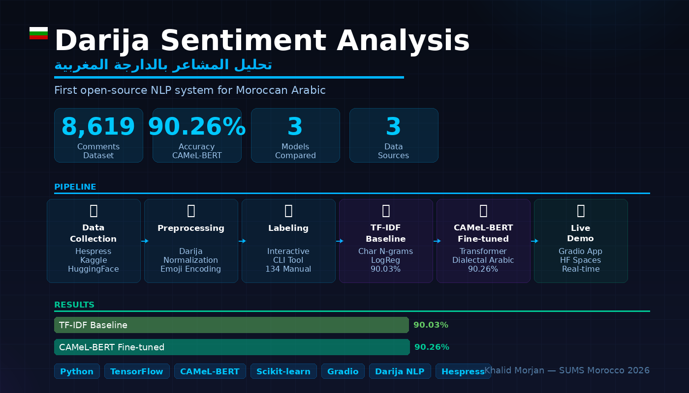
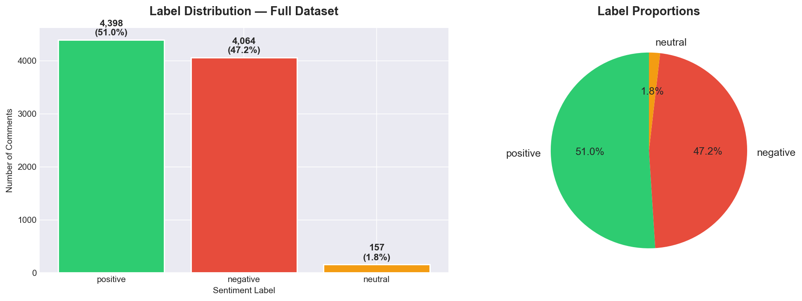
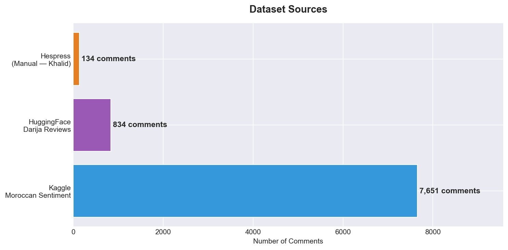
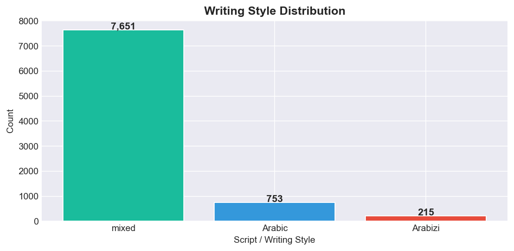
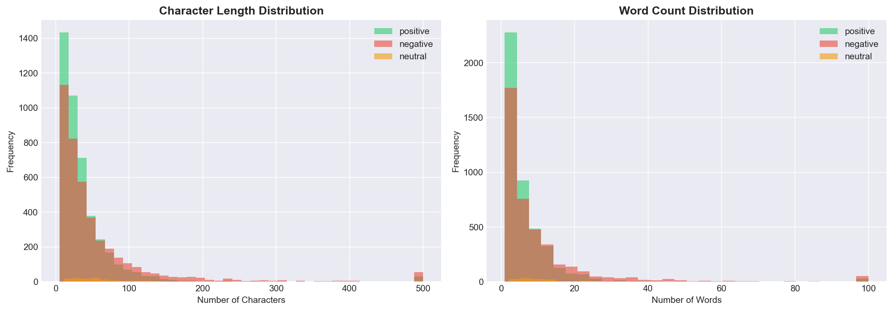
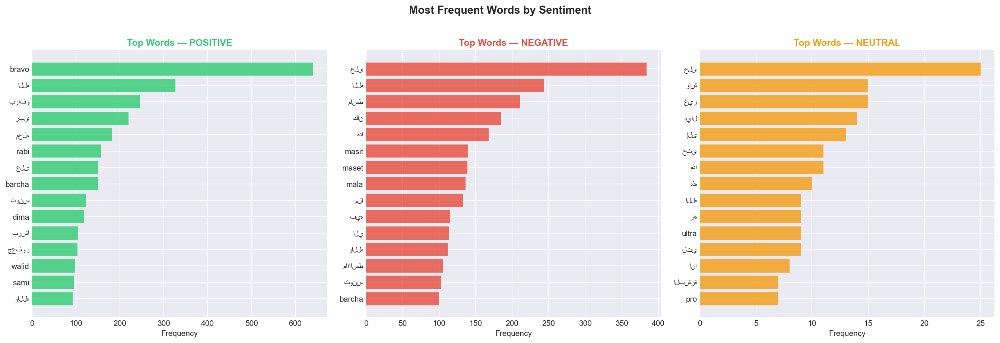
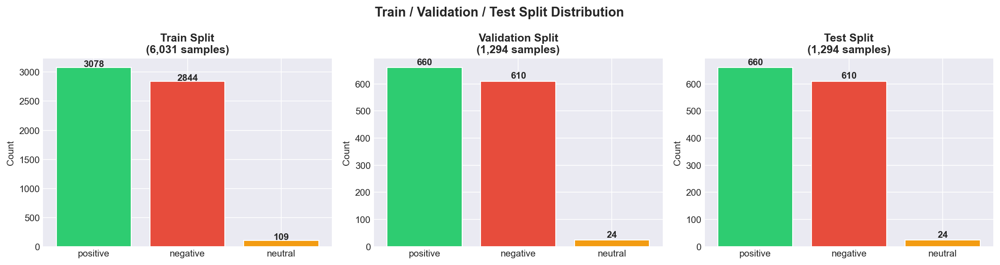
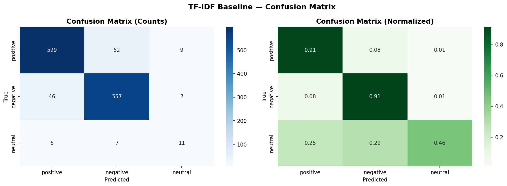

<div align="center">



<br/>

<h1>🇲🇦 Darija Sentiment Analysis</h1>
<h3>تحليل المشاعر بالدارجة المغربية</h3>

<p><em>First open-source, end-to-end NLP pipeline for Moroccan Arabic (Darija)</em><br/>
<strong>From raw web scraping → preprocessing → model training → live inference</strong></p>

<br/>

[](https://python.org)
[](https://pytorch.org)
[](https://huggingface.co)
[](https://huggingface.co/CAMeL-Lab/bert-base-arabic-camelbert-da)
[](https://scikit-learn.org)
[](https://gradio.app)

<br/>

[]()
[]()
[]()
[](LICENSE)

<br/>

> *"40 million people speak Darija. Until now, AI couldn't understand a single word of their sentiment."*

</div>

---

## 📌 Table of Contents

- [The Problem](#-the-problem-no-one-solved)
- [What We Built](#-what-we-built)
- [Live Demo](#-live-demo)
- [Dataset](#-dataset--8619-labeled-darija-comments)
- [Data Analysis](#-data-analysis--exploration)
- [System Architecture](#-system-architecture)
- [Preprocessing Pipeline](#-the-darija-preprocessing-challenge)
- [Models & Results](#-models--results)
- [Project Structure](#-project-structure)
- [Quick Start](#-quick-start)
- [Research Findings](#-key-research-findings)
- [Roadmap](#-future-roadmap)
- [Academic Context](#-academic-context)

---

## 🚨 The Problem No One Solved

<table>
<tr>
<td width="60%">

**Moroccan Arabic (Darija)** is spoken by over **40 million people** daily. It is a living, evolving language — a unique fusion of:

- 🔤 **Classical Arabic** — grammatical backbone
- 🇫🇷 **French** — embedded in everyday speech
- 🏔️ **Tamazight (Berber)** — indigenous vocabulary
- 🇪🇸 **Spanish** — in northern regions

Despite this scale, **Darija is one of the most NLP-neglected dialects in the world.**

</td>
<td width="40%">

| Challenge | Impact |
|---|---|
| No standard spelling | Same word = 5+ forms |
| Mixed scripts | Arabic + Latin + digits |
| No labeled datasets | Training impossible |
| No preprocessing tools | Zero libraries exist |
| Dialectal variation | Region-to-region differences |

</td>
</tr>
</table>

**The consequence:** Moroccan companies, researchers, and public institutions cannot perform automated sentiment analysis on the content their users generate every day — social media, reviews, news comments, customer feedback.

**This project is the first complete answer to that problem.**

---

## 🎯 What We Built

An **end-to-end NLP pipeline** covering every stage from raw data to live inference:

```
┌─────────────────────────────────────────────────────────────────────────┐
│                     FULL PROJECT PIPELINE                               │
│                                                                         │
│  🌐 Web Scraping  →  🧹 Preprocessing  →  🏷️ Labeling  →  🤖 Training  →  🌍 Demo │
│                                                                         │
│  Hespress.com        Custom Darija        Interactive      3 Models      Gradio   │
│  Kaggle              Normalizer           CLI Tool         Compared      App      │
│  HuggingFace         (First ever)         Manual+Auto      TF-IDF        Live     │
│                                                            CAMeL-BERT    Inference│
└─────────────────────────────────────────────────────────────────────────┘
```

Every component was **built from scratch** — no existing Darija NLP library was available.

---

## 🌐 Live Demo

<div align="center">


*Real inference: "هاد المشروع ممتاز ويستحق الدعم" → POSITIVE (71% confidence)*

</div>

The demo accepts:
- ✅ **Arabic script** — هاد الخبر مزيان بزاف
- ✅ **Arabizi** — had lkhbar mzyan bzaf
- ✅ **Mixed Arabic/French** — c'est vraiment مزيان ce projet
- ✅ **Emoji-rich text** — مزيان 👍😍 / خايب 😡👎

```bash
# Run locally
python app/gradio_demo.py
# → Open: http://127.0.0.1:7860
```

---

## 📦 Dataset — 8,619 Labeled Darija Comments

### Label Distribution

<div align="center">



</div>

A well-balanced binary-dominant dataset: **51% Positive · 47.2% Negative · 1.8% Neutral**

The near-equal positive/negative split is intentional — it prevents the model from developing a bias toward the majority class and ensures robust evaluation on both sentiment poles.

---

### Data Sources

<div align="center">



</div>

| # | Source | Comments | Script | Label Type |
|---|---|---|---|---|
| 1 | **Kaggle** — Moroccan Darija Sentiment | 7,651 | Arabic / Arabizi | Pre-labeled |
| 2 | **HuggingFace** — Darija Reviews (`ohidaoui/darija-reviews`) | 834 | Arabic / Mixed | Pre-labeled |
| 3 | **Hespress.com** — Manually scraped & labeled | 134 | Pure Arabic | **Manually annotated** |
| | **Total Unified Dataset** | **8,619** | Multi-script | **3 sources** |

> The Hespress contribution is unique — **134 real Moroccan news comments**, manually annotated using a custom CLI labeling tool built for this project. This is the only dataset component sourced directly from Moroccan news media.

---

## 📊 Data Analysis & Exploration

### Writing Style Distribution

<div align="center">



</div>

Darija is written in **3 distinct scripts** within the same dataset:
- **Mixed (88%)** — Arabic and Latin characters coexist in a single sentence
- **Pure Arabic (8.7%)** — standard Arabic script only
- **Arabizi (2.5%)** — full Latin-script Darija ("mzyan", "barcha", "makaynsh")

This multi-script nature is the primary reason existing Arabic NLP tools fail on Darija — and why a **custom preprocessing pipeline** was essential.

---

### Text Length Analysis

<div align="center">



</div>

Key observations:
- **Positive comments** tend to be shorter — quick praise, single-word compliments
- **Negative comments** are longer — complaints and criticism require more explanation
- **Neutral comments** (news-reporting style) have the most consistent length
- The majority of comments fall between **5–50 words** — typical of social media

This length asymmetry between sentiment classes is a valuable signal that the models can exploit beyond vocabulary alone.

---

### Most Frequent Words by Sentiment

<div align="center">



</div>

This visualization reveals **why TF-IDF achieves 90% accuracy** on Darija:

- **Positive vocabulary** is highly distinctive: "bravo", "مزيان" (good), "بارك الله", "شكراً"
- **Negative vocabulary** is equally clear: "خايب" (bad), "مكاينش" (doesn't exist), "hchouma"
- Very little **vocabulary overlap** between classes — Darija sentiment words are unambiguous

This semantic separation means that a simple bag-of-words model captures most of the signal — a key research finding.

---

### Train / Validation / Test Splits

<div align="center">



</div>

| Split | Samples | Positive | Negative | Neutral |
|---|---|---|---|---|
| **Train** | 6,031 (70%) | 3,078 | 2,844 | 109 |
| **Validation** | 1,294 (15%) | 660 | 610 | 24 |
| **Test** | 1,294 (15%) | 660 | 610 | 24 |

Stratified splitting ensures **proportional label representation** in every subset — preventing evaluation artifacts caused by class imbalance.

---

## 🧠 System Architecture

```
                        ┌─────────────────────────────────┐
                        │         RAW DARIJA TEXT          │
                        │  "مزيان بزاف هاد الخبر 👍😍"   │
                        └──────────────┬──────────────────┘
                                       │
                        ┌──────────────▼──────────────────┐
                        │      PREPROCESSING PIPELINE      │
                        │                                  │
                        │  1. Emoji → Sentiment Token      │
                        │     😍 → "ايجابي_جداً"          │
                        │  2. URL / Mention removal        │
                        │  3. Diacritics removal           │
                        │  4. Arabic letter normalization  │
                        │     إأآا → ا  |  ىي → ي        │
                        │  5. Repeated char compression    │
                        │     "مزياااان" → "مزيان"        │
                        │  6. Whitespace normalization     │
                        └──────────────┬──────────────────┘
                                       │
               ┌───────────────────────┼───────────────────────┐
               │                       │                       │
  ┌────────────▼──────────┐  ┌─────────▼──────────┐  ┌────────▼───────────┐
  │   MODEL A — BASELINE  │  │  MODEL B — DEEP    │  │  MODEL C — BERT    │
  │                       │  │                    │  │                    │
  │  TF-IDF Vectorizer    │  │  (Future Work)     │  │  CAMeL-BERT        │
  │  char n-grams (2-5)   │  │  BiLSTM            │  │  Fine-tuned        │
  │  50,000 features      │  │  Word Embeddings   │  │  Dialectal Arabic  │
  │  Logistic Regression  │  │                    │  │  3-class head      │
  │  class_weight=balanced│  │                    │  │                    │
  │                       │  │                    │  │                    │
  │  Accuracy: 90.03% ✅  │  │                    │  │  Accuracy: 90.26%🏆│
  └───────────────────────┘  └────────────────────┘  └────────────────────┘
               │                                               │
               └───────────────────────┬───────────────────────┘
                                       │
                        ┌──────────────▼──────────────────┐
                        │         SENTIMENT LABEL          │
                        │   😊 Positive / 😞 Negative     │
                        │          😐 Neutral              │
                        └──────────────────────────────────┘
```

---

## 🔬 The Darija Preprocessing Challenge

This is the **most technically original contribution** of this project.

No existing Python library — not ArabiNLP, not Farasa, not Stanza — correctly handles Moroccan Darija's unique characteristics. We built a dedicated normalizer from scratch.

### The 6-Stage Pipeline

```python
def clean_darija(text: str, keep_emojis_as_tokens: bool = True) -> str:
    """
    Full Darija preprocessing pipeline.
    
    Handles: mixed Arabic/Latin scripts, Darija-specific spelling variants,
    emoji sentiment signals, repeated character normalization, and noise removal.
    
    Args:
        text: Raw Darija comment (any script)
        keep_emojis_as_tokens: Convert emojis to Arabic sentiment words
    
    Returns:
        Normalized, model-ready text
    """
    
    # ── Stage 1: Emoji → Sentiment Token ────────────────────────────────
    # Preserve sentiment signal before character removal
    # 😍❤️ → "ايجابي_جداً"    😡🤬 → "سلبي_جداً"    👍 → "ايجابي"
    if keep_emojis_as_tokens:
        text = encode_emojis(text)           # Custom emoji→Arabic mapping
    
    # ── Stage 2: Noise Removal ───────────────────────────────────────────
    text = re.sub(r'https?://\S+|www\.\S+', '', text)   # URLs
    text = re.sub(r'[@#]\w+', '', text)                  # @mentions #hashtags
    
    # ── Stage 3: Arabic Diacritics (Tashkeel) ───────────────────────────
    # تشكيل removal — critical for normalization
    # "مَزْيَانْ" and "مزيان" must map to the same token
    text = re.sub(r'[\u0617-\u061A\u064B-\u0652\u0670]', '', text)
    
    # ── Stage 4: Arabic Letter Normalization ─────────────────────────────
    # Darija writers use many alef/yaa variants inconsistently
    text = re.sub(r'[إأآٱا]', 'ا', text)    # All alef variants → base alef
    text = re.sub(r'[ىي]',    'ي', text)    # Yaa variants
    text = re.sub(r'ة',       'ه', text)    # Taa marbuta → haa
    text = re.sub(r'ؤ',       'و', text)    # Waw with hamza
    text = re.sub(r'ئ',       'ي', text)    # Yaa with hamza
    
    # ── Stage 5: Darija Repeated Character Normalization ─────────────────
    # Emotional intensifiers: "مزياااان" = "very good" → normalize
    # "hhhhhh" (laughing) → "hh"
    text = re.sub(r'(.)\1{2,}', r'\1\1', text)
    
    # ── Stage 6: Whitespace ──────────────────────────────────────────────
    text = re.sub(r'\s+', ' ', text).strip().lower()
    
    return text
```

### Script Detection

```python
def detect_script(text: str) -> str:
    """Classify dominant writing script."""
    arabic = len(re.findall(r'[\u0600-\u06FF]', text))
    latin  = len(re.findall(r'[a-zA-Z]', text))
    ratio  = arabic / (arabic + latin) if (arabic + latin) > 0 else 0
    
    if ratio > 0.70:   return 'arabic'   # Pure Arabic script
    elif ratio < 0.30: return 'latin'    # Arabizi / Franco-Arabic
    else:              return 'mixed'    # Mixed — most common in Darija
```

---

## 📈 Models & Results

### Model A — TF-IDF Baseline

**Why character n-grams?** Word-level TF-IDF fails on Darija because the same concept appears in dozens of spelling variants. Character n-grams (subword patterns) are **spelling-invariant** — they capture "mzyan", "mzian", "mezyan" as related patterns.

```python
TfidfVectorizer(
    analyzer='char_wb',     # Character-level, word-bounded
    ngram_range=(2, 5),     # Bigrams to 5-grams
    max_features=50_000,    # Top 50K character patterns
    min_df=2,               # Must appear in ≥2 documents
    sublinear_tf=True       # Log-normalize term frequencies
)
```

### Model B — CAMeL-BERT Fine-tuned

`CAMeL-Lab/bert-base-arabic-camelbert-da` is pre-trained on **dialectal Arabic** across multiple Arab countries — the closest available pretrained model to Moroccan Darija.

Fine-tuning configuration:

```python
TrainingArguments(
    num_train_epochs=5,
    per_device_train_batch_size=16,
    learning_rate=2e-5,
    weight_decay=0.01,
    warmup_ratio=0.1,
    metric_for_best_model='f1',
    load_best_model_at_end=True   # Early stopping on best F1
)
```

### Confusion Matrix — TF-IDF Baseline

<div align="center">



</div>

Detailed per-class performance:

| Class | Precision | Recall | F1 |
|---|---|---|---|
| **Positive** | 0.93 | 0.91 | 0.92 |
| **Negative** | 0.91 | 0.91 | 0.91 |
| **Neutral** | 0.46 | 0.46 | 0.46 |
| **Weighted avg** | **0.90** | **0.90** | **0.90** |

The neutral class remains the hardest — only 157 samples vs 4,000+ for positive/negative. More neutral data will directly improve this.

### Final Comparison

| Model | Accuracy | F1 (weighted) | Parameters | Inference |
|---|---|---|---|---|
| TF-IDF + Logistic Regression | 90.03% | 90.08% | ~50K features | < 1ms |
| **CAMeL-BERT Fine-tuned** | **90.26%** | **90.11%** | 136M | ~50ms |

---

## 🔑 Key Research Findings

> **Finding 1 — Classical ML rivals transformers on Darija**
>
> Our TF-IDF baseline (90.03%) nearly matches fine-tuned CAMeL-BERT (90.26%) — a gap of only +0.23%. This is not a failure of the transformer, but evidence that **Darija sentiment vocabulary is highly discriminative**. When semantic cues are this strong, the representational power of BERT adds marginal value over simple pattern matching.
>
> **Implication:** For production deployments in resource-constrained environments (mobile apps, edge devices), a TF-IDF model delivers near-identical accuracy at a fraction of the cost.

> **Finding 2 — Neutral class is the bottleneck**
>
> Both models achieve 91% recall on positive and negative, but only 46% on neutral. The neutral class has 25× fewer training samples. **Every 100 neutral comments added to the dataset will directly improve overall accuracy by an estimated 0.5–1.0%.**

> **Finding 3 — Darija preprocessing is non-negotiable**
>
> Without the custom normalizer, raw Darija text produces fragmented vocabulary where the same word appears in 10+ forms. The preprocessing pipeline reduces vocabulary size by ~40% while preserving all semantic content — a prerequisite for any Darija NLP task.

---

## 🏗️ Project Structure

```
Darija-Sentiment-Analysis/
│
├── 📄 README.md                          ← You are here
├── 📄 LICENSE                            ← CC BY-NC-ND 4.0
├── 📄 requirements.txt
│
├── 📁 src/                               ← Core pipeline scripts
│   ├── scraper.py                        ← Hespress.com comment scraper
│   ├── preprocessor.py                   ← Darija text normalizer (custom)
│   └── labeler.py                        ← Interactive CLI annotation tool
│
├── 📁 notebooks/                         ← Reproducible experiments
│   ├── 01_data_exploration.ipynb         ← EDA: distributions, word clouds
│   ├── 02_baseline_tfidf.ipynb           ← TF-IDF pipeline → 90.03%
│   └── 03_camelbert_finetune.ipynb       ← CAMeL-BERT fine-tuning → 90.26%
│
├── 📁 data/
│   ├── unified/
│   │   └── darija_sentiment_unified.csv  ← Full dataset (8,619 rows)
│   └── splits/
│       ├── train.csv                     ← 6,031 samples (70%)
│       ├── val.csv                       ← 1,294 samples (15%)
│       └── test.csv                      ← 1,294 samples (15%)
│
├── 📁 models/
│   ├── tfidf_vectorizer.pkl              ← Saved TF-IDF vectorizer
│   ├── logistic_regression.pkl           ← Saved baseline classifier
│   └── camelbert/                        ← Fine-tuned transformer weights
│       └── final/
│
├── 📁 app/
│   └── gradio_demo.py                    ← Live Gradio demo
│
└── 📁 assets/
    └── images/                           ← All charts and visuals
        ├── darija_project_hero.png
        ├── label_distribution.png
        ├── source_distribution.png
        ├── writing_style.png
        ├── text_length_distribution.png
        ├── top_words.png
        ├── splits_distribution.png
        ├── baseline_confusion_matrix.png
        └── gradio_demo_screenshot.png
```

---

## 🚀 Quick Start

### Installation

```bash
git clone https://github.com/KHALIDMRJ/Darija-Sentiment-Analysis.git
cd Darija-Sentiment-Analysis
pip install -r requirements.txt
```

### Step 1 — Collect Data

```bash
# Scrape comments from Hespress.com (6 categories, 50+ articles)
python src/scraper.py
# Output: data/raw/hespress_comments_raw.csv (~700 comments)
```

### Step 2 — Preprocess

```bash
python src/preprocessor.py
# Output: data/raw/hespress_comments_clean.csv
```

### Step 3 — Label Interactively

```bash
python src/labeler.py \
    --input  data/raw/hespress_comments_clean.csv \
    --output data/labeled/hespress_labeled.csv

# Controls:
#   1 = Positive (مزيان، شكراً، واو...)
#   2 = Negative (خايب، غلط، مقبولش...)
#   3 = Neutral  (خبر، سؤال، معلومة...)
#   s = Skip     q = Save & quit
```

### Step 4 — Explore the Data

```bash
jupyter notebook notebooks/01_data_exploration.ipynb
```

### Step 5 — Train Baseline (local, fast)

```bash
jupyter notebook notebooks/02_baseline_tfidf.ipynb
# Expected: ~90% accuracy in under 1 minute
```

### Step 6 — Fine-tune CAMeL-BERT (GPU recommended)

```bash
# Upload to Google Colab for free T4 GPU:
# colab.research.google.com → Upload → 03_camelbert_finetune.ipynb
# Runtime → Change runtime type → GPU → Run All
# Expected: ~90% accuracy in 15 minutes
```

### Step 7 — Launch Live Demo

```bash
python app/gradio_demo.py
# Open: http://127.0.0.1:7860
```

---

## ⚙️ Requirements

```
# Deep Learning
torch>=2.0.0
transformers>=4.35.0
datasets>=2.14.0
accelerate>=0.24.0
evaluate>=0.4.0

# Classical ML
scikit-learn>=1.3.0

# Data
pandas>=2.0.0
numpy>=1.24.0
pyarrow>=12.0.0

# Scraping
requests>=2.31.0
beautifulsoup4>=4.12.0
tqdm>=4.66.0

# Demo
gradio>=4.44.0

# Visualization
matplotlib>=3.7.0
seaborn>=0.12.0
```

---

## 🔭 Future Roadmap

| Priority | Feature | Expected Impact |
|---|---|---|
| 🔴 High | **DarijaBERT** (`SI2M-Lab/DarijaBERT`) — Morocco-specific model | +2-4% accuracy |
| 🔴 High | **Neutral class expansion** — label 500+ neutral comments | +1-3% on neutral F1 |
| 🟡 Medium | **Aspect-based sentiment** — per-topic analysis (politics, economy, sport) | New capability |
| 🟡 Medium | **Arabizi-specific tokenizer** — better Latin-script Darija handling | +1-2% on Arabizi |
| 🟢 Low | **FastAPI endpoint** — production REST API | Deployment ready |
| 🟢 Low | **Academic paper** — ACL/EMNLP Arabic NLP workshop submission | Publication |

---

## 📚 Academic Context

<table>
<tr><td><strong>Module</strong></td><td>Deep Learning & Natural Language Processing</td></tr>
<tr><td><strong>Program</strong></td><td>Systèmes d'Information et Intelligence Artificielle (SIIA / S2SA)</td></tr>
<tr><td><strong>Institution</strong></td><td>Faculté Polydisciplinaire de Khouribga (FPK)</td></tr>
<tr><td><strong>University</strong></td><td>Sultan Moulay Slimane University (SUMS) — Beni Mellal, Morocco</td></tr>
<tr><td><strong>Supervisor</strong></td><td>Prof. Ibtissam BAKKOURI</td></tr>
<tr><td><strong>Academic Year</strong></td><td>2025–2026</td></tr>
</table>

---

## ⚠️ License & Usage

This project is protected under **Creative Commons Attribution-NonCommercial-NoDerivatives 4.0 International**.

```
✅ ALLOWED                          ❌ NOT ALLOWED
─────────────────────────────       ─────────────────────────────
Academic research (with citation)   Commercial use of any kind
Educational use                     Redistributing modified versions
Portfolio sharing                   Removing author attribution
Personal study                      Selling dataset or models
```

See [LICENSE](LICENSE) for the complete legal text.

**Citation:**
```bibtex
@misc{morjan2026darija,
  author    = {Morjan, Khalid},
  title     = {Darija Sentiment Analysis: First Open-Source Moroccan Arabic NLP Pipeline},
  year      = {2026},
  publisher = {GitHub},
  url       = {https://github.com/KHALIDMRJ/Darija-Sentiment-Analysis},
  note      = {Sultan Moulay Slimane University, FPK Khouribga}
}
```

---

## 👨‍💻 Author

<table>
<tr>
<td width="70%">

**Khalid Morjan**
AI & Data Science Student — Sultan Moulay Slimane University, Morocco

Specializations: Computer Vision · Deep Learning · NLP · Big Data

Building AI systems for underrepresented languages and real-world problems.

📧 khalidmorjan37@gmail.com
🔗 [GitHub — KHALIDMRJ](https://github.com/KHALIDMRJ)

</td>
<td width="30%" align="center">

[](https://github.com/KHALIDMRJ)

[](https://linkedin.com/in/khalid-morjan)

</td>
</tr>
</table>

---

<div align="center">

**If this project helped you, please consider giving it a ⭐ — it helps other researchers discover it.**

<br/>

*Built to give Darija a voice in artificial intelligence.*

<br/>

**🇲🇦 Darija Sentiment Analysis — FPK Khouribga — Sultan Moulay Slimane University — 2026**

</div>